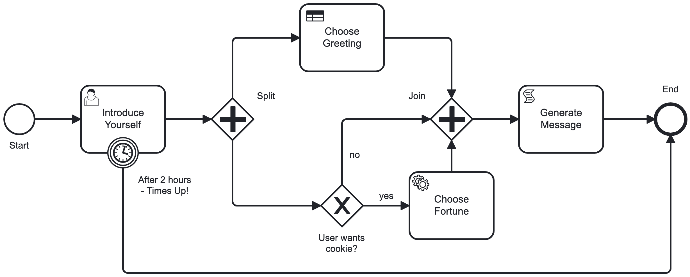

# Spot Flow

Spot Flow is a workflow engine for Rails applications based on the [bpmn](https://www.bpmn.org) standard. It executes business processes defined in a [modeler](https://camunda.com/download/modeler/). It uses [Spot Feel](https://github.com/connectedbits/spot-feel) to evaluate expressions and business rules in the BPMN model. It can be used with [Spot Form](https://github.com/connectedbits/spot-form) to render dynamic forms for user tasks.

## Usage

The engine executes business processes like [this one](/test/fixtures/files/hello_world.bpmn).



To start the process, initialize Spot Flow with the BPMN and DMN source files, then call `start`.

```ruby
execution = SpotFlow.new([File.read("hello_world.bpmn"), File.read("choose_greeting.dmn")]).start
```

It's often useful to print the process state to the console.

```ruby
execution.print
```

```ruby
HelloWorld started * Flow_0zlro9p

0 StartEvent Start: completed * out: Flow_0zlro9p
1 ServiceTask SayHello: waiting * in: Flow_0zlro9p
```

The 'HelloWorld' process began at the 'Start' event and is `waiting` at the 'SayHello' task. This is an important concept in the SpotFlow engine. It's designed to be used in a Rails application where a process might be waiting for a user to complete a form, or a background job to complete. It's common to save the state the process until a task is complete. Calling `serialize` on a process will return the execution state so it can be continued later.

```ruby
# Returns a hash of the process state.
execution_state = execution.serialize

# Now we can save the execution state in a database until a user submits a form (UserTask)
# or a background job completes (ServiceTask)

# Restores the process from the execution state.
execution = SpotFlow.restore(File.read("hello_world.bpmn"), execution_state:)

# Now we can continue the process by `signaling` the waiting task.
step = execution.step_by_element_id("SayHello")
step.signal(message: "Hello World!")
```

Now the 'SayHello' task is completed, it's result is merged into the process variables, and the process continues to the 'End' event.

```ruby
HelloWorld completed *

{
  "message": "Hello World!"
}

0 StartEvent Start: completed * out: Flow_0zlro9p
1 ServiceTask SayHello: completed { "message": "Hello World!" } * in: Flow_0zlro9p * out: Flow_1doumjv
2 EndEvent End: completed * in: Flow_1doumjv
```

TODO: Expand usage to include expanded hello world example.

## Documentation

- [Processes](/docs/processes.md)
- [Tasks](/docs/tasks.md)
- [Events](/docs/events.md)
- [Event Definitions](/docs/event_definitions.md)
- [Gateways](/docs/gateways.md)
- [Expressions](/docs/expressions.md)
- [Data Flow](/docs/data_flow.md)
- [Execution](/docs/execution.md)

## Installation

Execute:

```bash
$ bundle add spot_flow
```

Or install it directly:

```bash
$ gem install spot_flow
```

## Development

```bash
$ git clone ...
$ bin/setup
$ bin/rake
$ bin/guard
```

## License

The gem is available as open source under the terms of the [MIT License](https://opensource.org/licenses/MIT).

Developed by [Connected Bits](http://www.connectedbits.com)
